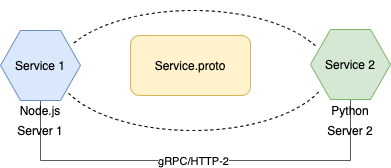

# **Laboratorio gRPC**

**Curso:** Tópicos Especiales en Telemática <br>
**Título:** Comunicación entre Procesos Remotos: gRPC.<br>
**Objetivo:** Desarrollar habilidades en la comunicación entre procesos distribuidos utilizando llamadas a procedimientos remotos (RPCs), especificamente gRPC.<br>

*******

**Tabla de Contenido**

1. [Introducción](#introduction)
2. [Conceptos](#conceptos)
3. [Recursos](#resources)
4. [Desarrollo](#development) 
5. [Despliegue](#deployment) <br>

*******

<div id='introduction'/> 

### **1. Introducción**

En este laboratorio vamos a desarrollar habilidades básicas en los aspectos de programación distribuida relacionados con  la comunicación de procesos remotos utilizando gRCP. 

Para esto, se presenta un ejemplo de dos procesos, uno construido en python y el otro en node.js, con el fin de que estos se comuniquen utilizando gRPC. La definición de la interfaz del servicio se realiza empleando protocol buffers


*******

<div id='conceptos'/> 

### **2. Conceptos**

La comunicación entre procesos distribuidos tradicionalmente se soporta sobre el paso de mensajes. En la actualidad, uno de los mecanismos que se emplea es gRPC. Acorde con (https://grpc.io/), gRPC es un framework open-source, moderno y eficiente que permite la comunicación entre procesos distribuidos. De esta forma, es posible conectar, invocar así como operar dos o mas procesos distribuidos, tal como si estuvieramos empleando llamadas a funciones de manera local. El protocolo de transporte para la comunicación gRPC es HTTP/2.

De esta forma, al momento de empezar a desarrollar una aplicación con RPCs (y gRCP no es la excepción), lo primero que hay que hacer es realizar la definición de una interfaz de servicio. En esta, lo que se especifica es como la funcionalidad del servicio que estamos exponiendo debe ser consumido. En dicha interfaz, aspectos como que métodos puede ser consumidos remotamente, los parámetros así como el formato de mensajes requeridos para invocar dichos métodos, son definidos. 

Para el caso particular de gRPC, el lenguaje de definición de interfaz (IDL), se denomina Protocol Buffers (https://protobuf.dev/). Este IDL es una plataforma agnóstica que no depende del sistema operativo o lenguaje de programación y que permite la serialización de datos estructurados. En la actualidad, se puede trabajar con diferentes tipos de lenguajes de programación, como Java, Python, C++, Go, etc. 

*******

<div id='resources'/> 

### **3. Recursos**

Para el desarrollo de este laboratorio se utilizaran dos lenguajes de programación: pythoy y node.js. Igaulmete, se desplegará dos instancias en AWS, una para cada servicio.

*******

<div id='development'/>  

### **4. Desarrollo**

En las siguientes subsecciones se describen el conjunto de pasos que se requieren para el desarrollo de la actividad.

#### **4.1. Alcance:**

A continuación, en la figura 1, se presenta la arquitectura que se va implementar en este laboratorio. Como se puede observar, se van a implementar dos servicios, los cuales estan desarrollados en lenguajes de programación diferentes: python y node.js. 

De esta forma, ambos servicios se podrán comunicar entre sí utilizando gRPC. Para lograr esto, se requiere la definición de un la interfaz de servicio así como la códificación de cada uno de los servicios en cada uno de los lenguajes.



<div id='instance'/> 

#### **4.2. Estructura del Proyecto:**

En este repositorio, va a encontrar la siguiente estructura para el proyecto:

* La carpeta "Back" contiene la definición de cada una de las carpetas para cada servicio.
* Una carpeta img, para las diferentes imágenes que componen este proyecto.
* Un archivo README.md a maner de documentación de este proyecto así como de guía de este laboratorio.

#### **4.3. Definición la Interfaz del Servicio:**

Para la definición de la interfaz del servicio, como se mencionó anteriormente, se utilizará el lenguaje de definición de interfaz (IDL): Protocol Buffers. 

Es así como se definirá un archivo Servicio.proto, el cual contiene la definición del esquema de los datos estructurados que se quieren serializar.

```js
syntax = "proto3";

message Product{
    int32 id_product = 1;
}

message TransactionResponse{
    int32 status_code = 1;
}

service ProductService{
    rpc AddProduct(Product) returns (TransactionResponse) {}
}

```

Del código anterior, se observa lo siguiente: 

* La etiqueta "syntax" nos indica que la versión de protocol buffers que se está empleado es "proto3". 
* Se definen dos mensajes: Product y TransactionResponse. El mensaje "Product" tiene un solo atributo que es "id_product" y es definido del tipo entero. Para el caso del mensaje "TransactionResponse", este tiene un atributo denominado "status_code" igualmente del tipo entero.
* Se observa la definición de un servicio "ProductService", para esto se especifíca con la expresión "service" en el archivo .proto. Luego, como se puede observar, se define el método RPC al interior de la definición el servicio. Note que se especifica tanto la petición como la respuesta. Para el caso particular de este ejemplo, se específica el método "AddProduct(Product)", el cual recibe el mensaje "Product" y el método retorna como respuesta el mensaje "TransactionResponse".
* Todo lo antes mencionado, se convierte en la definición del contrato de interfaz (API) para el consumo de diferentes servicios remotos.

De esta forma, es posible serializar un objeto desde el servicio 1, el cual está escrito en un lenguaje de programación como node.js, enviarlo sobre una red de datos, y deserializarlo en el servicio 2, el cual está escrito en un lenguaje de programación como python. 

#### **4.4. Servicio 1 en Node.js:**

El servicio 1 esta desarrollado en node.js como entorno de ejecución. En el proyecto se encuentra el archivo "server.js", el cual tiene la implementación del código (cliente para este caso) que hace una llamada a un procedimiento remoto ubicado en otro servidor. De esta forma "node.js" genera el client stub así como los descriptores de los servicios a consumir. Todo esto en tiempo de ejecución. Para esto, se requiere cargar el archivo "Servicio.proto" (definición del servicio) el cual esta en la carpeta "protobufs".

En el caso particular de node.js, se requiere para el proyecto importar las librerias '@grpc/grpc-js' y '@grpc/proto-loader'. Igualmente, se le especifica la ruta donde se encuentra la definición del servicio (Servicio.proto) la cual se almacena en la variable "PROTO_PATH".

```js
import dotenv from 'dotenv';
import grpc from '@grpc/grpc-js';
import protoLoader from '@grpc/proto-loader';

dotenv.config()

const PROTO_PATH = process.env.PROTO_PATH;
const REMOTE_HOST = process.env.REMOTE_HOST;

const packageDefinition = protoLoader.loadSync(
    PROTO_PATH,
    {keepCase: true,
     longs: String,
     enums: String,
     defaults: true,
     oneofs: true
    });

```

A partir de esto, se procede a crear el "client stub": 
 
```js
const client = new productService(REMOTE_HOST,grpc.credentials.createInsecure());
```

donde "REMOTE_HOST" indica la localización del servicio remoto (IP:PORT). 

Una vez creado el "client stub" procedemos desde éste a invocar la llamada al procedimiento remoto con:

```js
  client.AddProduct({id_product: idProduct}, (err, data) => {
    if(err){
      console.log(err);   // Se procesa y visualiza por consola el error.
    } else {
      console.log('Response received from remote service:', data); // Se procesa y visualiza el mensaje de respuesta recibido.
    }
   });
```
Es así como que del fragmento de código anterior, se visualiza que el procedimiento remoto (AddProduct) se llama desde el cliente y se pasa el parámetro del producto que se requiere adicionar, en este caso "id_product". Como se puede observar, en caso tal la llamada al procedimiento remoto se exitoso, se imprime la respuesta por consola, en caso contrario, se procesa el error. Se puede notar, que estas llamadas son asincrónicas e implementan "callbacks" para recibir los resultados a la llamada.

#### **4.5. Servicio 2 en Python:**

El servicio 2 de este ejemplo está desarrollado en Python. Al igual que para el caso del primer servicio el cual fue implementado en node.js, lo primero que hay que hacer es obtener la definición del servicio. Para esto, puede observar, que en la carpeta "protobufs", se encuentra el archivo "Servico.proto". 

En la carpeta "src", se puede visualizar el archivo server.py. Al analizar el código, se puede observar que la función server() es llamada desde la función main(). 

```python
def serve():
  server = grpc.server(futures.ThreadPoolExecutor(max_workers=10))
  Service_pb2_grpc.add_ProductServiceServicer_to_server(ProductService(), server)
  server.add_insecure_port('[::]:8080')
  print("Service is running... ")
  server.start()
  server.wait_for_termination()
```
En dicha función, la expresión grpc.server nos permite crear el servidor con el máximo número de hilos (worker) como parámetro. Posterior, lo siguiente es proceder a registrar/asociar la clase "ProductService()" con el servidor. Aqui se lanza el servicio corriendo el puerto especificado y se inicia el servicio como el método start().

#### **5 Despliegude de los Servicios:**

En esta sección crearemos dos instancias EC2 en AWS, las cuales nos permitirán desplegar y ejectuar cada uno de los dos servicios desarrollados. Recuerde que, para caso de este laboratorio, ambas VMs estaran asociadas a VPC por defecto. Diríjase al “home” de la consola de administración de AWS. Escoja el servicio de EC2. En el panel izquierdo seleccione la opción de “Instances” seleccione la opción “launch instances” y ejecute lo siguientes pasos:

* **Name and Tags:**
    * Name: vm-Service.
* **Application and OS Images (Amazon machine image)**
    * Escoja la imagen de Amazon Machine Image (AMI) la cual contiene la imagen del sistema operativo. Seleccione Ubuntu server 20.04 LTS (HVM), SSD Volume Type. Free Tier.
* **Instance type:** Seleccione el tipo de instancia t2.micro (columna type) 
* **Key pair (login):** Seleccione una llave existente o en su defecto cree una nueva.
* **Network Settings:** Ahora configure, los siguientes parámetros (click en edit):
    * **Network:** Seleccione la VPC que esta por defecto.
    * **Subnet:** No preference (Default subnet in any availability zone)
    * **Auto-assign Public IP:** Enable
    * **Firewall (security groups):**
        * Seleccione la opción de “create security group” 
        * Active las casillas para el tráfico SSH y HTTP.Permita que reciban peticiones de cualquier dirección. 
        * **Nota:** Para el caso de ssh, recuerde que posteriormente puede modificar el security group para permitir solo conexiones desde la dirección IP que usted indique.
* **Configure storage:** 1 x 8 Gib gp2 root volume 

En la parte final de este proceso, seleccione crear dos instancias. Una vez las dos máquinas estén creadas, proceda a modificar el nombre de cada una de las instancias en el menú: vm-Service1 y vm-Service2.

Ahora vamos a proceder a conectarnos a la máquina creada de la siguiente forma:

* En una terminal de consola desde su máquina, inicie una sesión ssh contra el servidor que configuro. Recuerde, que en caso de ser necesario, antes, debe cambiar los permisos del archivo .pem que creo. Para esto aplique el comando: 

```sh
ubuntu@dirIP $ chmod 400 labuser.pem
```

#### **5.2. Instalación de Servicio 2 en Python :**

En esta sección vamos a proceder a instalar las dependencias necesarias para poder ejecutar nuestro servicio 2 en python. Se debe garantizar que se cuente con una versión de python igual o superior a 3.7 así como una versión de pip igual o superior a 9.0.1.

Antes que todo, actualice 

```sh
 $ sudo apt-get update
 $ sudo apt-get upgrade
```

Ahora proceda a instalar python3 así como actualizad pip:

```sh
 $ sudo apt-get install python3
 $ sudo apt-get install python3-pip
```

Instale las librerias requeridas para gRPC:

```sh
$ sudo python3 -m pip install grpcio
$ sudo python3 -m pip install grpcio-tools
```

Ahora, se clona el repositorio donde está el código:

```sh
$ sudo git clone https://github.com/st0263eafit/st0263-242.git 
```

Particularmente, para el caso de python, se hace necesario generar las interfaces a partir de la deinifición del archivo "Service.proto" y a diferencia de node.js, esto no se hace en tiempo de ejecución. Para esto, se hace necesario estar en el directorio "src" de la carpeta "PaymentService" y ejecutar el siguiente comando:

```sh
 $ sudo python3 -m grpc_tools.protoc -I ../protobufs --python_out=. --pyi_out=. --grpc_python_out=. ../protobufs/Service.proto
```

Como se puede observar, se generaron tres archivos. Ahora puede proceder a ejecutar el servicio de la siguiente forma:

```sh
$ sudo python3 server.py
```
#### **5.2. Instalación de Servicio 1 en Node.js :**

En esta sección vamos a proceder a instalar las dependencias necesarias para poder ejecutar nuestro servicio 1 en node.js. Se debe garantizar que se cuente con una versión de node igual o superior a 18.X.

Antes que todo, actualice el sistema operativo de la máquina:

```sh
 $ sudo apt-get update
 $ sudo apt-get upgrade
```
Ahora se procede a instalar la versión de Node.js v19.X:

```sh
$ sudo curl -fsSL https://deb.nodesource.com/setup_19.x | sudo -E bash - && sudo apt-get install -y nodejs
```
Ahora, se clona el repositorio donde está el código:

```sh
$ sudo git clone https://github.com/st0263eafit/st0263-242.git 
```
Localizados en el directorio "src" de la carpeta "OnlineService", modifique el archvo ".env de la siguiente forma:

```sh
$ sudo nano .env
```
se requiere modificar la variable "REMOTE_HOST" y asignarle la dirección IP pública donde se está ejecutando el servicio2 (servicio en python). Se hace necesario verificar que el la instancia EC2 donde corre el servicio 2 (python), permita el tráfico TCP entrante en el puerto seleccionado (para este caso 8080).

Finalmente, ejecute el servicio de la siguiente forma:

```sh
$ sudo node server.js
```

*******
