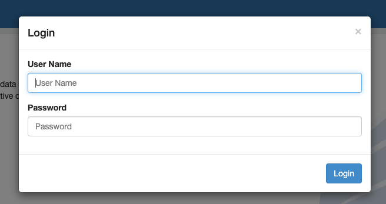
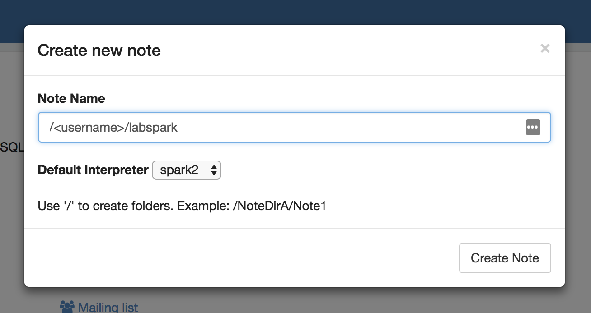

# Universidad EAFIT
# Curso ST0263 Tópicos Especiales en Telemática, 2024-2

# LAB SPARK

* Se puede programar en python, scala o java.

* ejemplos en python:

## 1. De forma interactiva via 'pyspark' (en el nodo master de EMR)

// ya trae preconfigurado las variables sc y spark

    $ pyspark
    >>> files_rdd = sc.textFile("hdfs:///datasets/gutenberg-small/*.txt")
    >>> files_rdd = sc.textFile("s3://emontoyadatasets/gutenberg-small/*.txt")
    >>> wc_unsort = files_rdd.flatMap(lambda line: line.split()).map(lambda word: (word, 1)).reduceByKey(lambda a, b: a + b)
    >>> wc = wc_unsort.sortBy(lambda a: -a[1])
    >>> for tupla in wc.take(10):
    >>>     print(tupla)
    >>> wc.saveAsTextFile("hdfs:///tmp/wcout1")

    * asi salva wc un archivo por rdd.
    * si quiere que se consolide en un solo archivo de salida:

    $ pyspark
    >>> ...
    >>> ...
    >>> wc.coalesce(1).saveAsTextFile("hdfs:///tmp/wcout2")

## 2. Como un archivo python: [wc-pyspark.py](wc-pyspark.py)

* correrlo:

    $ spark-submit --master yarn --deploy-mode cluster wc-pyspark.py

## 3. Desde Zeppelin Nodebook:

    * Si es en EMR, por defecto NO tiene login/pass



Cree un Notebook:




### Wordcount en python:

```python
    %spark2.pyspark
    # WORDCOUNT COMPACTO
    #files_rdd = sc.textFile("s3://emontoyadatasets/gutenberg-small/*.txt")
    files_rdd = sc.textFile("hdfs:///datasets/gutenberg-small/*.txt")
    wc_unsort = files_rdd.flatMap(lambda line: line.split()).map(lambda word: (word, 1)).reduceByKey(lambda a, b: a + b)
    wc = wc_unsort.sortBy(lambda a: -a[1])
    for tupla in wc.take(10):
        print(tupla)
    wc.coalesce(1).saveAsTextFile("hdfs:///tmp/wcout1")
```
## 4. Jupyter Notebooks en EMR

1. Clone el cluster EMR
2. cree un notebook
3. importe el archivo [wordcount-spark.ipynb](wordcount-spark.ipynb) o copie las lineas en un nonebook nuevo.
4. Ejecute el notebook paso a paso y comprenda los diferentes pasos.

### NOTA: Manejo de notebooks en EMR

* varias opciones:

    ** a través del servicio jupyterhub como componente de EMR
    ** Notebooks como servicio de amazon para EMR (opción a trabajar)

Para trabajar con los notebooks gestionados por amazon, la gestión de paquetes, versión de python puede ser consultado en:

    https://docs.aws.amazon.com/emr/latest/ManagementGuide/emr-managed-notebooks-scoped-libraries.html

* Opciones importantes:

** cambiar versión de python:

    %%configure -f
    { "conf":{
    "spark.pyspark.python": "python3",
    "spark.pyspark.virtualenv.enabled": "true",
    "spark.pyspark.virtualenv.type":"native",
    "spark.pyspark.virtualenv.bin.path":"/usr/bin/virtualenv"
    }}

** Example – Listing Current Libraries

    sc.list_packages()

** Example – Installing the NLTK Library

    sc.install_pypi_package("nltk")

** Example – Uninstalling a Library

    sc.uninstall_package("nltk")